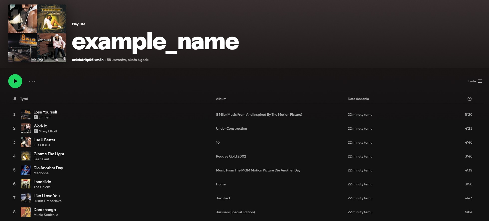
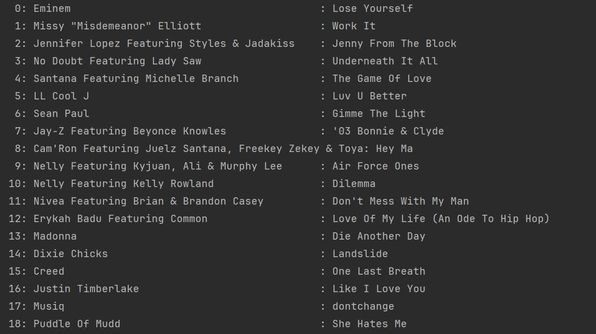

# Music Scraping to spotify playlist

An application that scrapes a webpage for the TOP 100 songs on a chosen date and creates a Spotify playlist from them using Spotipy.

Here is the playlist on spotify and console output after the program has been executed

